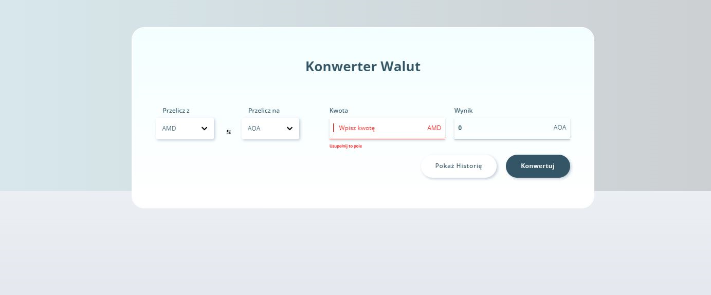
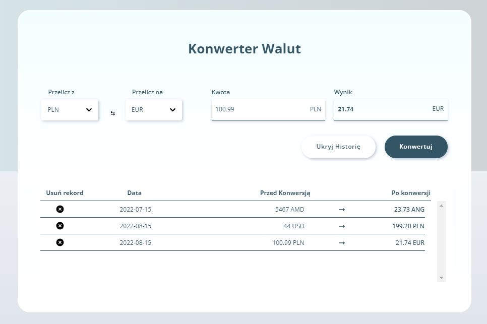
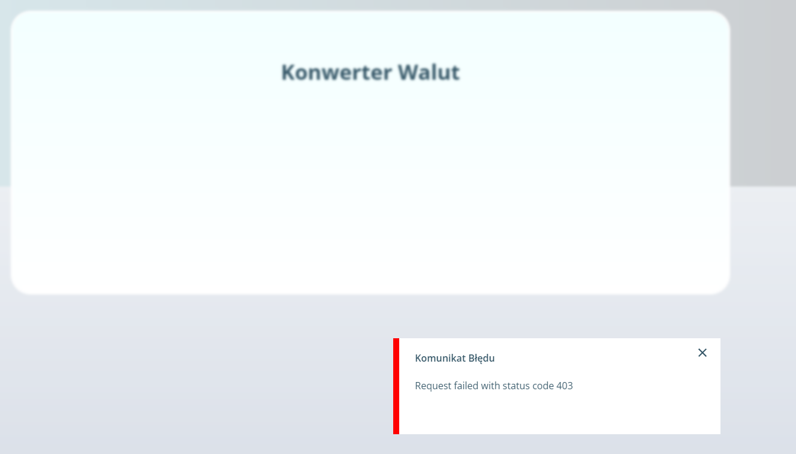
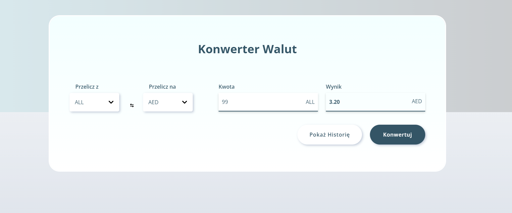

# Getting Started with Create React App

## Description

To make this project, I used ReactJS, Typescript, React Query, React Hook Forms. To convert currency, project connects to the external api and save history to Localstorage

### How to Run this project?

Got to site: https://currency-converter-site.netlify.app  
U can also check this project on your own computer.  
1. Download the repository from github Page
2. After unzip open project with IDE
3. Don't forget about API key for test this APP - register here: https://app.exchangerate-api.com/ and create .env file in the main folder
4. Copy This code `REACT_APP_API_KEY = KEY` to .env file, then paste your own key 
5. Use `npm install`
6. Then `npm start`.
7. [http://localhost:3000](http://localhost:3000) to view it in the browser.
